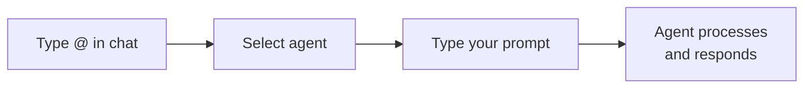
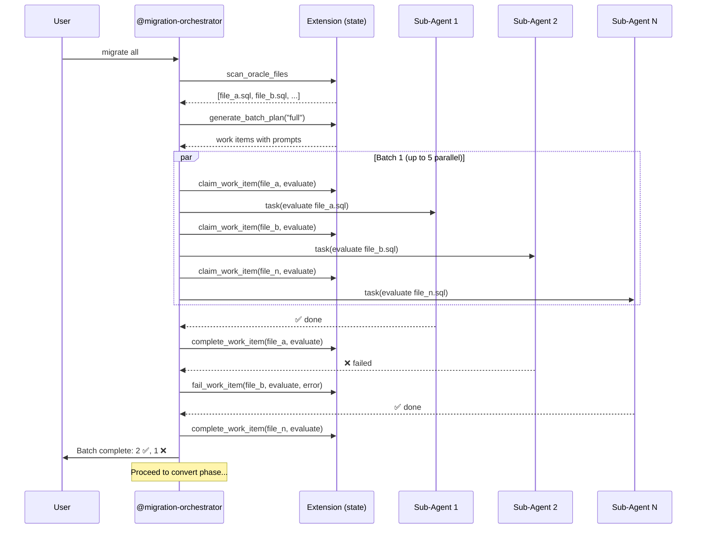
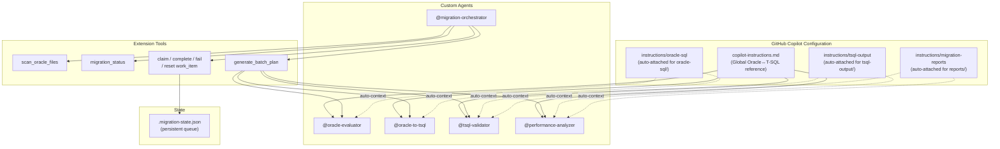

# Utilization Guide

How to use this Oracle-to-TSQL migration toolkit with **GitHub Copilot CLI** and **VS Code with GitHub Copilot Chat**.

---

## Prerequisites

- [GitHub Copilot](https://github.com/features/copilot) subscription (Individual, Business, or Enterprise)
- One of:
  - **Copilot CLI** (`gh copilot` or `copilot` standalone)
  - **VS Code** with the [GitHub Copilot Chat](https://marketplace.visualstudio.com/items?itemName=GitHub.copilot-chat) extension (v0.22+)
- This repository cloned locally

---

## Using with VS Code + GitHub Copilot Chat

### Setup

1. **Clone the repo** and open it in VS Code:
   ```bash
   git clone https://github.com/samueltauil/oracle-to-tsql.git
   cd oracle-to-tsql
   code .
   ```

2. **Drop your Oracle SQL files** into the `oracle-sql/` folder (drag-and-drop or copy).

3. **Open Copilot Chat** (`Ctrl+Shift+I` / `Cmd+Shift+I`) or use the Chat panel.

### Using Custom Agents

In the Copilot Chat input, type `@` to see available agents, then select one:



#### Evaluate a single file
```
@oracle-evaluator evaluate oracle-sql/pkg_orders.sql
```

#### Convert a file
```
@oracle-to-tsql convert oracle-sql/pkg_orders.sql
```

#### Validate a converted file
```
@tsql-validator validate tsql-output/pkg_orders.sql against its Oracle source
```

#### Analyze performance
```
@performance-analyzer analyze tsql-output/pkg_orders.sql
```

#### Batch migrate all files
```
@migration-orchestrator migrate all files in oracle-sql/
```

### Using Context-Aware Instructions

The toolkit automatically provides context based on which files you're viewing:

| When you open files in... | Copilot automatically knows... |
|---------------------------|-------------------------------|
| `oracle-sql/` | These are read-only Oracle source files for analysis |
| `tsql-output/` | These must follow T-SQL output standards (headers, SET options, TRY/CATCH) |
| `migration-reports/` | These are reports with specific format requirements |

This means even **regular Copilot Chat** (without `@agent`) gives migration-aware suggestions when you're working in these directories.

### Tips for VS Code

- **Attach files to chat**: Click the 📎 icon or drag files into the chat to give the agent more context.
- **Use `#file` references**: Type `#file:oracle-sql/my_proc.sql` in the chat to reference specific files.
- **Inline chat** (`Ctrl+I` / `Cmd+I`): Select Oracle SQL code and ask Copilot to convert it inline.
- **Compare side-by-side**: Open the Oracle file and its T-SQL output side by side to review conversions.

---

## Using with GitHub Copilot CLI

### Setup

1. **Clone and enter the repo**:
   ```bash
   git clone https://github.com/samueltauil/oracle-to-tsql.git
   cd oracle-to-tsql
   ```

2. **Drop your Oracle SQL files** into `oracle-sql/`:
   ```bash
   cp /path/to/your/oracle-files/*.sql oracle-sql/
   ```

3. **Start a Copilot CLI session**:
   ```bash
   copilot
   ```

### Custom Tools (available immediately)

The extension provides tools that the CLI agent can use. Ask Copilot to use them:

```
> Scan all Oracle SQL files in the project
```
→ Copilot calls `scan_oracle_files`, discovers files, syncs state.

```
> Show migration status
```
→ Copilot calls `migration_status`, shows per-file progress.

### Single-File Workflow

#### Step 1: Evaluate

```
> @oracle-evaluator evaluate oracle-sql/pkg_orders.sql
```

Copilot reads the Oracle file, identifies complexity, Oracle-specific features, dependencies, and saves a report to `migration-reports/evaluation-pkg_orders.md`.

#### Step 2: Convert

```
> @oracle-to-tsql convert oracle-sql/pkg_orders.sql
```

Copilot reads the evaluation report for context, then converts the Oracle SQL to T-SQL following 100+ conversion rules, saving to `tsql-output/pkg_orders.sql`.

#### Step 3: Validate

```
> @tsql-validator validate tsql-output/pkg_orders.sql
```

Copilot compares the converted T-SQL against the original Oracle SQL, checking for semantic equivalence, common conversion bugs (empty-string-as-NULL, DECODE-with-NULL, ROWNUM ordering), and saves a report.

#### Step 4: Performance Analysis

```
> @performance-analyzer analyze tsql-output/pkg_orders.sql
```

Copilot reviews the T-SQL for cursor-to-set-based opportunities, implicit conversions, index recommendations, and SQL Server-specific optimizations.

### Batch Workflow (Multiple Files)

The `@migration-orchestrator` agent dispatches parallel sub-agents — one per file:



#### Migrate everything

```
> @migration-orchestrator migrate all
```

This runs the full pipeline: **evaluate → convert → validate → analyze** across all files, batched in groups of 5 parallel sub-agents.

#### Run a specific phase

```
> @migration-orchestrator evaluate all
> @migration-orchestrator convert all
> @migration-orchestrator validate all
> @migration-orchestrator analyze all
```

#### Check status

```
> @migration-orchestrator status
```

#### Retry failures

```
> @migration-orchestrator retry failed
```

### CLI Tips

- **Start with evaluation**: Always evaluate before converting — the evaluation report gives the converter important context.
- **Check status often**: Use `migration_status` or `@migration-orchestrator status` between batches.
- **Review reports**: Reports in `migration-reports/` contain detailed findings — review them before moving to the next phase.
- **Retry selectively**: After a batch, failed files can be retried without re-running successful ones.

---

## Common Scenarios

### Scenario 1: Quick single-file conversion

You have one Oracle procedure to convert quickly.

```
> @oracle-to-tsql convert oracle-sql/get_employee.sql
```

The converter reads the global instructions for reference tables and produces the T-SQL output.

### Scenario 2: Assess a large codebase before committing to migration

You have 200+ Oracle SQL files and need to understand the scope.

```
> @migration-orchestrator evaluate all
```

After evaluation, review `migration-reports/evaluation-summary.md` for:
- Complexity distribution (how many simple vs. complex files)
- Common patterns across files
- Recommended migration order
- High-risk items needing manual attention

### Scenario 3: Iterative conversion with validation

Convert and validate one file at a time, fixing issues as you go.

```
> @oracle-evaluator evaluate oracle-sql/pkg_billing.sql
  (review evaluation report)

> @oracle-to-tsql convert oracle-sql/pkg_billing.sql
  (review converted output)

> @tsql-validator validate tsql-output/pkg_billing.sql
  (review validation report, fix any issues)

> @performance-analyzer analyze tsql-output/pkg_billing.sql
  (apply performance recommendations)
```

### Scenario 4: Full automated pipeline

Hands-off migration of all files through every phase.

```
> @migration-orchestrator migrate all
```

Then review the generated summary at `migration-reports/migration-summary.md`.

---

## How It Works Under the Hood



### Configuration Files Explained

| File | What it does | When it activates |
|------|-------------|-------------------|
| `.github/copilot-instructions.md` | Provides comprehensive Oracle↔T-SQL mapping tables (data types, functions, syntax, constructs) | Every Copilot interaction in this project |
| `.github/instructions/oracle-sql.instructions.md` | Tells Copilot these are read-only Oracle sources; guides analysis approach | When working with `oracle-sql/**` files |
| `.github/instructions/tsql-output.instructions.md` | Enforces T-SQL output standards (headers, SET options, error handling, GO separators) | When working with `tsql-output/**` files |
| `.github/instructions/migration-reports.instructions.md` | Defines report format with severity tags | When working with `migration-reports/**` files |
| `.github/agents/*.md` | Defines specialized agent behavior with detailed prompts | When you invoke `@agent-name` |
| `.github/extensions/oracle-migration/extension.mjs` | Provides custom tools for file discovery, status tracking, batch orchestration | Automatically loaded at session start |

---

## Troubleshooting

### Extension tools not available

If custom tools like `scan_oracle_files` are not recognized:
- **VS Code**: Reload the window (`Ctrl+Shift+P` → "Developer: Reload Window")
- **Copilot CLI**: Run `/clear` to restart the session, which re-discovers extensions

### Agent not found

If `@oracle-evaluator` or other agents don't appear:
- Ensure you're in the root of this repository
- Ensure the `.github/agents/` directory exists with `.md` files
- Restart your Copilot session

### Sub-agents not running in parallel

The orchestrator dispatches sub-agents using `task` tool in background mode. If they run sequentially:
- This is expected in some environments — the orchestrator will still process all files
- Check `@migration-orchestrator status` for progress

### State file issues

If `migration_status` shows stale data:
```bash
# Reset all state
rm migration-reports/.migration-state.json
# Then re-scan
> scan all oracle files
```
