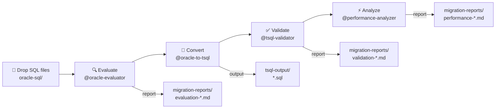
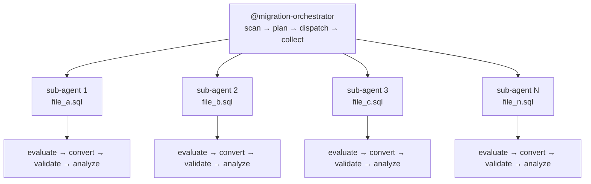
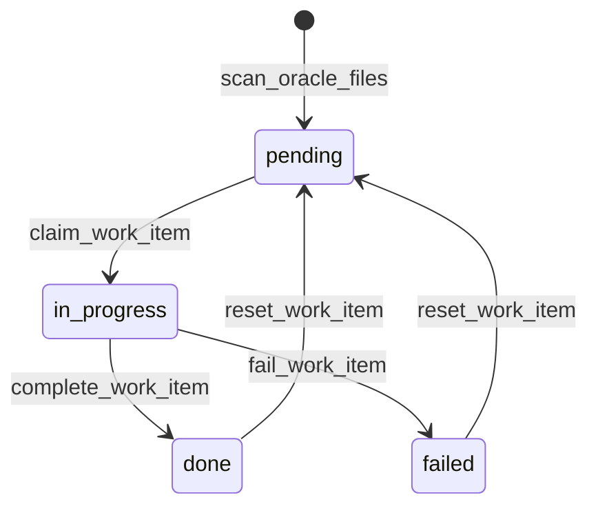

# Oracle to T-SQL Migration Toolkit

A GitHub Copilot-powered toolkit for migrating Oracle SQL/PL/SQL code to Microsoft SQL Server T-SQL. Uses custom agents, instructions, and extensions to evaluate, convert, validate, and optimize your SQL migration — with full support for batch processing across many files.

## Quick Start

1. **Drop** Oracle SQL files into `oracle-sql/`
2. **Evaluate**: `@oracle-evaluator evaluate all files in oracle-sql/`
3. **Convert**: `@oracle-to-tsql convert oracle-sql/my_procedure.sql`
4. **Validate**: `@tsql-validator validate tsql-output/my_procedure.sql`
5. **Optimize**: `@performance-analyzer analyze tsql-output/my_procedure.sql`

> For bulk migration across many files, use `@migration-orchestrator migrate all` — see [Batch Migration](#batch-migration-use-orchestrator-with-parallel-sub-agents).

## Project Structure

```
oracle-sql/              ← Drop Oracle SQL files here (source, read-only)
tsql-output/             ← Converted T-SQL output (auto-generated)
migration-reports/       ← Evaluation, validation & performance reports
.github/
  ├── copilot-instructions.md          ← Global conversion reference
  ├── instructions/
  │   ├── oracle-sql.instructions.md   ← Context for Oracle files
  │   ├── tsql-output.instructions.md  ← Standards for T-SQL output
  │   └── migration-reports.instructions.md
  ├── agents/
  │   ├── oracle-evaluator.md          ← @oracle-evaluator agent
  │   ├── oracle-to-tsql.md            ← @oracle-to-tsql agent
  │   ├── tsql-validator.md            ← @tsql-validator agent
  │   ├── performance-analyzer.md      ← @performance-analyzer agent
  │   └── migration-orchestrator.md    ← @migration-orchestrator agent
  └── extensions/
      └── oracle-migration/
          └── extension.mjs            ← Custom tools (scan, status, batch, state)
```

## Migration Pipeline



## Custom Agents

| Agent | Purpose | Example Usage |
|-------|---------|---------------|
| `@oracle-evaluator` | Assess migration complexity and risks | `@oracle-evaluator evaluate oracle-sql/pkg_orders.sql` |
| `@oracle-to-tsql` | Convert Oracle SQL → T-SQL | `@oracle-to-tsql convert oracle-sql/pkg_orders.sql` |
| `@tsql-validator` | Validate converted T-SQL correctness | `@tsql-validator validate tsql-output/pkg_orders.sql` |
| `@performance-analyzer` | Performance analysis and optimization | `@performance-analyzer analyze tsql-output/pkg_orders.sql` |
| `@migration-orchestrator` | Batch orchestration with parallel sub-agents | `@migration-orchestrator migrate all` |

## Custom Tools

### Discovery & Status
| Tool | Description |
|------|-------------|
| `scan_oracle_files` | Discovers Oracle SQL files, returns structured JSON with metadata |
| `migration_status` | Per-file status across all phases (pending/in_progress/done/failed) |
| `list_migration_reports` | Lists all generated reports with type classification |
| `init_migration_project` | Creates project directories and initializes state |

### Batch Orchestration
| Tool | Description |
|------|-------------|
| `generate_batch_plan` | Generates dispatch plan with sub-agent prompts per file+phase |
| `claim_work_item` | Locks a file+phase as in_progress before dispatching |
| `complete_work_item` | Marks file+phase as done after sub-agent succeeds |
| `fail_work_item` | Records failure with error message for retry |
| `reset_work_item` | Resets a file+phase to pending for retry |

## Workflow

### Single File (use individual agents)

```
@oracle-evaluator evaluate oracle-sql/my_proc.sql
@oracle-to-tsql convert oracle-sql/my_proc.sql
@tsql-validator validate tsql-output/my_proc.sql
@performance-analyzer analyze tsql-output/my_proc.sql
```

### Batch Migration (use orchestrator with parallel sub-agents)

```
@migration-orchestrator evaluate all
@migration-orchestrator convert all
@migration-orchestrator migrate all    ← full pipeline
@migration-orchestrator status
@migration-orchestrator retry failed
```

The orchestrator dispatches one sub-agent per file (up to 5 in parallel), tracks state via the extension, and aggregates results.



### Work Item State Machine



## Supported Oracle File Types

| Extension | Description |
|-----------|-------------|
| `.sql` | General SQL scripts |
| `.pls` | PL/SQL source |
| `.pks` | Package specification |
| `.pkb` | Package body |
| `.trg` | Trigger |
| `.vw` | View |
| `.fnc` | Function |
| `.prc` | Procedure |
| `.typ` | Type definition |
